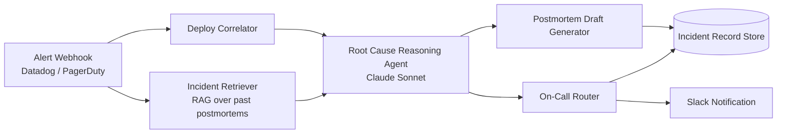

# Incident Commander Agent

**An AI agent that triages production incidents the way a senior SRE would:** it ingests a live alert, correlates it against recent deploys, pulls the most similar past incidents from a postmortem archive, reasons about the most likely root cause, drafts the postmortem, and routes the incident to the correct on-call engineer — all before a human has finished reading the page.

Modeled on the incident-response workflows used at large-scale infrastructure teams (Google SRE, AWS Ops, etc.), where alert fatigue and slow root-cause identification are some of the most expensive problems in production engineering.

---




**Pipeline stages:**

1. **Alert ingestion** — `POST /webhooks/alert` accepts a normalized alert payload (service, severity, metric, threshold, observed value), the same shape Datadog/PagerDuty webhooks would deliver.
2. **Deploy correlation** — looks up the most recent deploy to the affected service within a configurable lookback window (default 120 min). In production this hits the GitHub Deployments API or your CI/CD provider; here it's mocked so the repo runs with zero credentials.
3. **Incident retrieval (RAG)** — retrieves the most similar past incidents from a small postmortem corpus using tag/keyword overlap scoring. The retrieval interface is written so it can be swapped for a real embedding index (pgvector / Pinecone / Supabase Vector) without touching any calling code.
4. **Root cause reasoning agent** — a Claude-powered agent that synthesizes the alert, the suspected deploy, and similar past incidents into a single hypothesis with an explicit confidence level and justification. Falls back to a deterministic heuristic if no API key is configured, so the demo always runs.
5. **Postmortem draft generator** — turns the hypothesis into a structured Markdown postmortem, ready for a human to review and publish.
6. **On-call router** — maps the affected service to its owning team/engineer and posts a Slack notification (or prints it, if no webhook is configured).

## Tech stack

| Layer | Choice |
|---|---|
| Language | TypeScript / Node.js |
| Reasoning | Anthropic Claude API (`@anthropic-ai/sdk`) |
| Server | Express |
| Retrieval | Custom lightweight RAG (swappable for a real vector DB) |
| Notifications | Slack Incoming Webhooks |
| Data sources (mocked) | Datadog/PagerDuty alerts, GitHub deploys, postmortem archive |

## Getting started

```bash
git clone https://github.com/arleenkaur02/incident-commander-agent.git
cd incident-commander-agent
npm install
cp .env.example .env   # optional — the demo runs without any keys
```

**Run the simulation** (no server, no API keys needed — uses the deterministic fallback reasoning path):

```bash
npm run simulate
```

**Run the live server** and POST alerts to it yourself:

```bash
npm run dev
```

```bash
curl -X POST http://localhost:4000/webhooks/alert \
  -H "Content-Type: application/json" \
  -d '{
    "id": "alert-2001",
    "source": "datadog",
    "service": "checkout-service",
    "severity": "P1",
    "message": "Error rate on /checkout/confirm exceeded threshold",
    "metric": "http.5xx_rate",
    "threshold": "2%",
    "observedValue": "18.4%",
    "timestamp": "2026-07-23T14:02:11Z"
  }'
```

To get real LLM-generated reasoning instead of the heuristic fallback, add your key to `.env`:

```
ANTHROPIC_API_KEY=your_key_here
```

## Example output

Given a `P1` alert on `checkout-service` shortly after a payment gateway migration deploy, the agent produces:

```
Hypothesis: Likely regression introduced by deploy a1c9f21
("Migrate payment confirmation to new gateway client v3")
shortly before the alert fired.
Confidence: high
Routed to: priya.nair (Payments Platform)
```

...plus a full Markdown postmortem draft citing the suspected deploy, the two most similar past incidents (including one where a nearly identical gateway migration caused the same symptom), and suggested next steps.

## What I'd add with more time

- Swap the tag-overlap retriever for real embeddings over a larger historical postmortem corpus.
- Add a feedback loop where on-call engineers confirm/reject hypotheses, and use that signal to fine-tune confidence calibration.
- Multi-alert correlation — group related alerts firing within the same window into a single incident instead of processing them independently.
- Real GitHub Deployments API + Datadog webhook signature verification for production use.

## Project structure

```
src/
  index.ts                    Express server (webhook + incident endpoints)
  simulate.ts                 Standalone runner — no server/keys required
  orchestrator.ts              Wires the full pipeline together
  services/
    deployCorrelator.ts        Finds the suspect deploy for an alert
    incidentRetriever.ts       Lightweight RAG over past incidents
    rootCauseAgent.ts          Claude-powered reasoning + heuristic fallback
    postmortemGenerator.ts     Drafts the Markdown postmortem
    oncallRouter.ts            Service ownership lookup + Slack notification
  data/                        Mock alerts, deploys, past incidents, ownership map
  types/                       Shared TypeScript interfaces
```

---

Built by [Arleen Kaur Teerthy](https://github.com/arleenkaur02) as part of a series of production-style AI agent projects.
